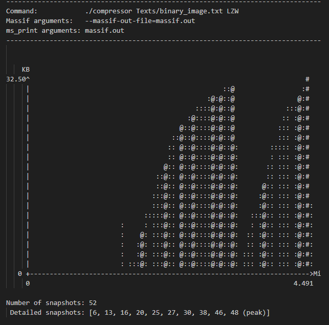
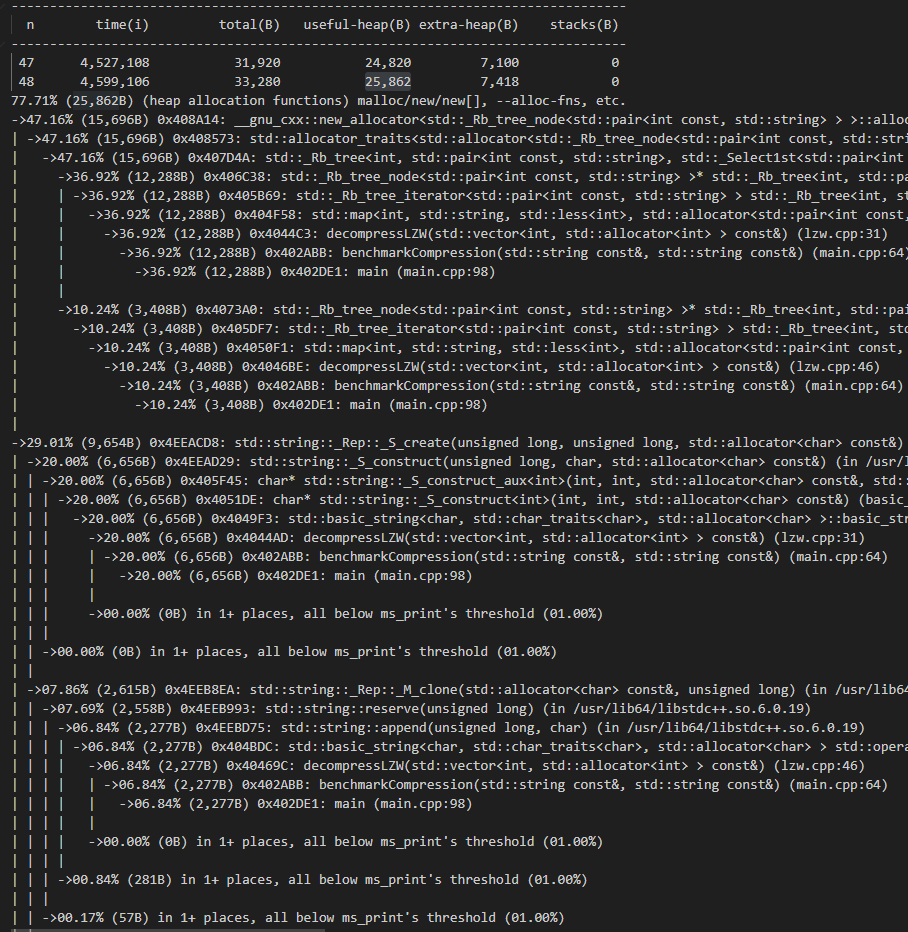

# Table of Contents
- [Table of Contents](#table-of-contents)
- [Description](#description)
- [Test Cases](#test-cases)
- [Test Results](#test-results)
    - [Recurrent Text](#recurrent-text)
    - [Lorem Ipsum](#lorem-ipsum)
    - [Binary Image](#binary-image)
    - [High Entropy](#high-entropy)
- [Valgrind Massif](#valgrind-massif)


# Description

This program take text file and algorithm (RLE or LZW) as input and run (de)compression for selected file with the choosen algorithm, record the process time and calculate the compression ratio.

- main.cpp is where the main program call the compression and decompression function as well as recording (de)compression time
- rle.cpp is the implementation of Run Length Encoding (de)compression
- lzw.cpp is the implementation of Dictionary Coder (de)compression. In this case Lempel-Ziv-Welch algorithm is choosen because its simplicity and popularity
- run.sh is just a shell script to automate the execution of various input for both algorithms

How to Run:
- Compile the c++ files.
```
g++ -c rle.cpp
g++ -c lzw.cpp
g++ -c file_io.cpp
g++ -o main main.cpp rle.o lzw.o file_io.o
```
- Run the main:
```
./main <filename> <algorithm>
```
if algorithm not specified, both RLE and LZW will be run.

For memory usage measurement, external profiler **Valgrind massif** is used because its capability to measure memory usage in detail.
```
valgrind --tool=massif --massif-out-file=massif.out ./main <filename> <algorithm>
```
<br>

# Test Cases

Due to development time constraint this code is limited to take input of string in file only.
4 text files have been provided in the test texts folder to benchmark the two algorithms.

- recurrent_text.txt consist of a string of repeated consecutive characters  
  `AAAAABBBBBBCCCCCCCCCDDDDDDDD`
- lorem_ipsum.txt consist of regular string with no particular meaning and pattern.  
  `Lorem ipsum dolor sit amet, consectetur adipiscing elit, sed do eiusmod tempor incididunt ut labore et dolore magna aliqua.
`
- binary_image.txt is a string representation of a simple black and white image.  
  
- high_entropy.txt is a string of 1000 random-generated alpha-numeric characters.  
  `Fe64a7NiAtr8PdZez08fAc8EcnZLTp43crx0TUt5Xd3dbhUFRSsJ2P79Dk89rYQFx5RFkbcHxvErwPsCkMOVzXT
7mDUqnP7DB5jN09V8GKmwxyJsIcPGtKuigkdIOPOVw92drM5qmLFr2`

<br>

# Test Results

Below is the test result for each test case. 

### Recurrent Text 

| Algorithm | Compression Ratio | Compression Time | Decompression Time | Memory Usage (Bytes) |
| :---------: | :-----------------: | :----------------: | :------------------: |:-------------:|
| `RLE`     | 3.5               | 4627 mi| 1770 mi  | 8890         |
| `LZW`     | 2               | 19506 mi| 11886 mi  | 20186         |

### Lorem Ipsum

| Algorithm | Compression Ratio | Compression Time | Decompression Time | Memory Usage (Bytes) |
| :---------: | :-----------------: | :----------------: | :------------------: |:-------------:|
| `RLE`     | 0.5               | 14918 mi| 4814 mi  | 8984         |
| `LZW`     | 1.27               | 17065 mi| 10465 mi  | 27240         |

### Binary Image 

| Algorithm | Compression Ratio | Compression Time | Decompression Time | Memory Usage (Bytes) |
| :---------: | :-----------------: | :----------------: | :------------------: |:-------------:|
| `RLE`     | 1.36               | 4913 mi| 2303 mi  | 9269         |
| `LZW`     | 3.51               | 18099 mi| 11091 mi  | 25862         |

### High Entropy

| Algorithm | Compression Ratio | Compression Time | Decompression Time | Memory Usage (Bytes) |
| :---------: | :-----------------: | :----------------: | :------------------: |:-------------:|
| `RLE`     | 0.5               | 8164 mi| 3159 mi  | 10421         |
| `LZW`     | 1.11               | 24524 mi| 16420 mi  | 93380         |

<br>

From the result we could see that:
- RLE thrive best when plenty of consecutive and repeated character exist in the string. Such case is rarely found in typical daily text so in more natural cases, RLE tend to not perform and even have larger compressed file than the file itself.
- LZW has very high effectivity when there are patterns in the data. Relatively short data and high entropy data with little to no pattern are failed to see the benefit of LZW
- Though LZW have relatively larger (de)compression time and memory usage compared to RLE, it is more robust. In 4 test cases, anytime RLE had good performance, LZW dont fall that far behind and when RLE was totally ineffective, LZW still at least gave a little impact.

<br>

# Valgrind Massif
The memory usage measurement by valgrind massif result is stored in the `massif_output` folder.
<br>

The massif output give summary at the very top. Massif take memory usage measurement in snapshots. The moment where the system has the highest memory usage is labelled with (peak). In the case below the peak is at snapshot **48**.
<br>



<br>

At the lower part, we could find details of snapshot **48**. `total(B)` is the total memory allocated. `useful-heap(B)` is the portion of the allocated memory that are actually used by the processed. `extra-heap(B)` is the portion of the allocated memory that are used as header and overhead. The detailed part also give breakdown each part of the process and their contribution to the memory usage. In larger algorithm development, we could use this information to optimize the part where the algorithm used much memory.
<br>


